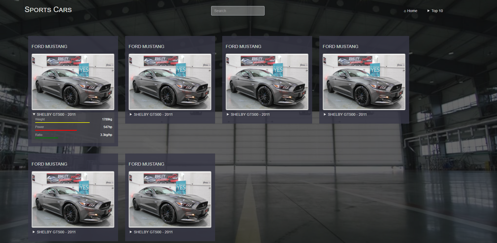

# TD1 - Maquette d'écran
Réaliser une page web statique qui ressemble à TD1-screenshot.png: 

## Intialisation des fichiers
- création index.html / index.css
- importer index.css dans index.html
- ajouter dans le `<head>` un favicon et un title

## Fond d'écran  de la page
- ajouter le fond d'écran pour qu'il couvre toute la page

## En-tête
- créer le header avec le titre et la textbox de recherche
- créer le menu dépliant _Top 10_
  - vous pouvez utiliser un code existant en recherchant "folding menu css"

## Carte 1
- créer une première carte en vous basant sur les données de index.js
- la partie avec les barres _weight_, _power_ et _ratio_ doit pouvoir se replier (vous pouvez utiliser `
` et `
`)
- les barres doivent ressembler au screenshot sans avoir la largeur exacte

## Dupliquer les cartes
- dupliquer le code HTML de la carte pour avoir une liste de 6 cartes au moins
- les cartes doivent s'afficher sur la ligne suivante si la largeur de l'écran n'est pas suffisante
- l'affichage doit s'adapter à la taille d'un téléphone portable avec les pseudo-classes CSS _portrait_ et _landscape_
