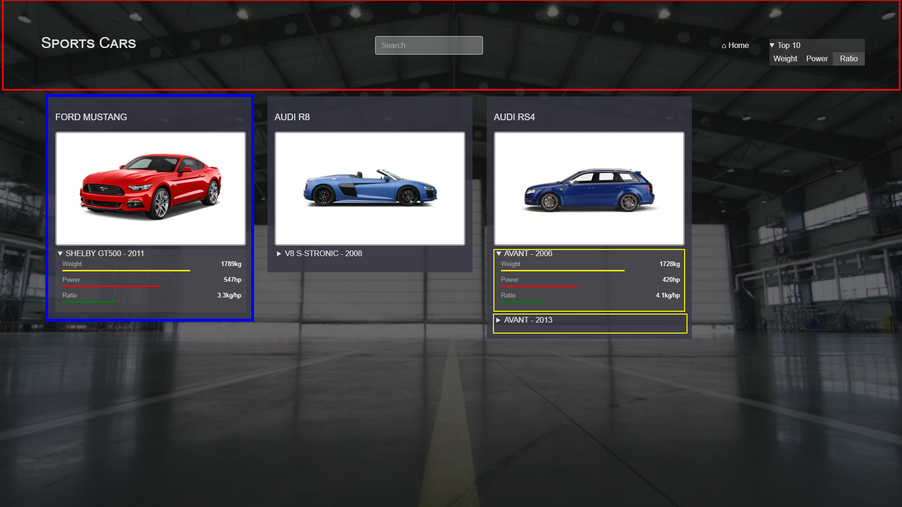

# TD-3 - React Components

Décomposer la page en composants ReactJS comme dans TD3-screenshot.png: 




En bleu : le composant _Model_ qui représente un modèle de voiture. Il y a une carte par _Model_.
En jaune : le composant _Car_ qui réprésente une variante du modèle. Il y a une section dépliante (avec les barres de couleur) par _Car_ 
En rouge : le composant _Header_ qui représente l'en-tête du site

## Composant _Model_
Créer le répertoire `src/model` contenant 2 fichiers : `Model.css` et `Model.js`.
- dans `model.js`, créer une fonction `Model` et l'exporter de la même façon que la fonction `App`
- déplacer le code de `App.js` concernant la carte dans le retour de la fonction `Model`
- déplacer le code de `App.css` concernant la carte dans le fichier `Model.css`
- importer les styles comme un fichier Javascript :
    ```
        import './Model.css';
    ```
- importer le composant _Model_ dans `App.js`:
    ```
        import Model from './model/Model';
    ```
- remplacer le code des cartes par l'appel au composant `Model`
    ```
        <Model />
    ```
> Le code de `App.js` devrait être déjà beaucoup plus simple.

## Composant _Car_
Créer le composants _Car_ selon le même principe dans le répertoire `src/model/car` et appelez-le dans `Model`.

## Composant _Header_
Créer le composants _Header_ selon le même principe dans le répertoire `src/header` et appelez-le dans `App`.

> Le code est à présent mieux découpé et plus facile à comprendre.
> L'arborescence de nos répertoires représente la hiérarchie de nos composants _métier_ (_containers_) :
 - _App_
   - _Model_ utilisé dans App
     - _Car_ utilisé dans Model
   - _Header_ utilisé dans App

> _Car_ ne sera pas réutilisé ailleurs, c'est pourquoi on l'a mis dans un sous-répertoire de _Model_.
> Si _Car_ était réutilisé dans d'autres composants _métier_, on aurait dû le déplacé dans un répertoire à part (par exemple `commons`).
