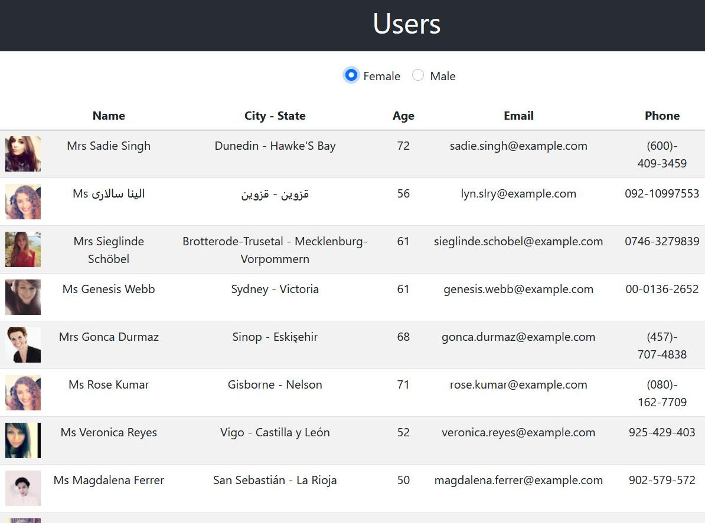
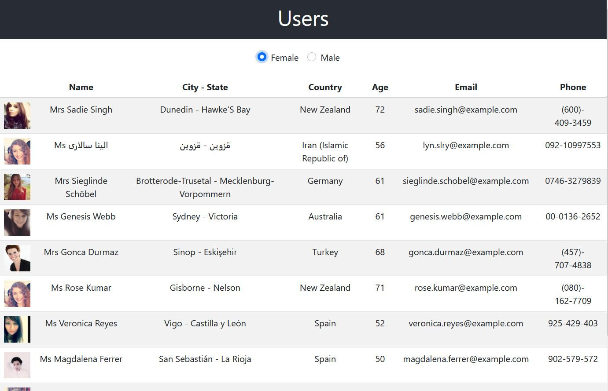
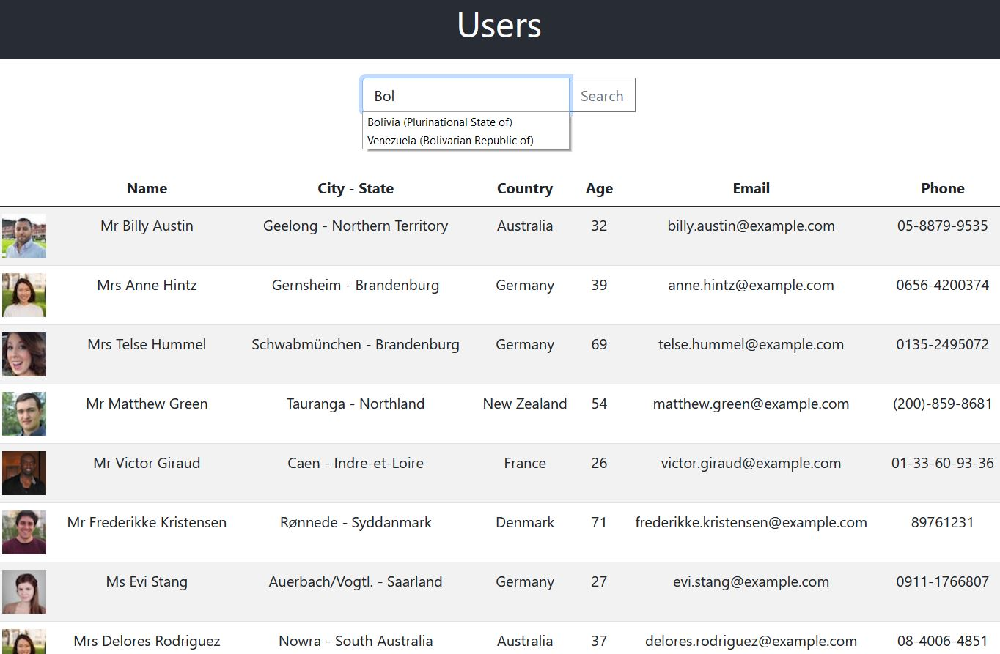

# TD9 - Affichage des utilisateurs

## Question 1
Vous utiliserez l'API https://randomuser.me pour créer une liste d'utilisateurs aléatoires:



La liste n'affichera **que 10 utilisateurs**.
Vous utiliserez le framework CSS [Bootstrap](https://getbootstrap.com) pour mettre en forme cette liste.
L'appel de l'API se fera avec le mode CORS:

```
  fetch(`https://randomuser.me/api/?results=10`, {mode: 'cors'})
``` 

Pour installer Boostrap, après avoir créer l'application :

`npm install -S bootstrap@next`

Puis faire l'import suivant dans vos fichiers Javascript où vous souhaitez utiliser les classes Boostrap:

`import 'bootstrap/dist/css/bootstrap.css';`

On pourra filtrer la liste grâce au filtre *gender* proposé par l'API (*male* / *female*)

## Question 2

Vous utiliserez l'API https://restcountries.eu pour obtenir la  liste des pays et leur code sur 2 caractères.

Cette liste vous permettra d'afficher la colonne *Country* avec le nom du pays, à partir de la propriété *nat* des utilisateurs :




## Question 3

Vous ajouterez [Boostrap datalist](https://getbootstrap.com/docs/5.0/forms/form-control/#datalists) pour afficher une textbox de recherche par pays:



